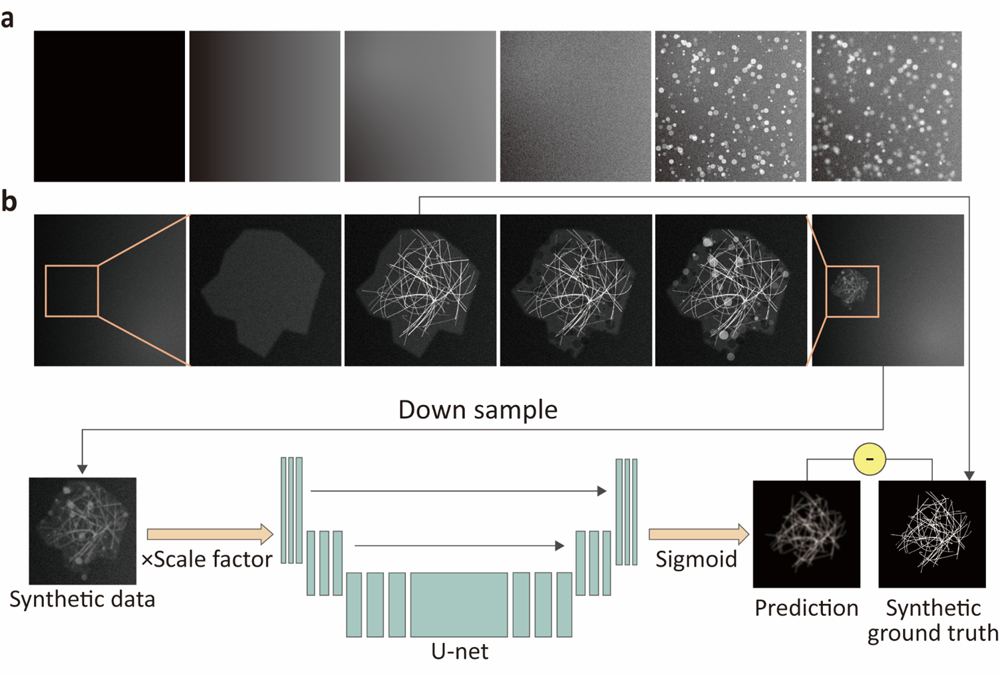
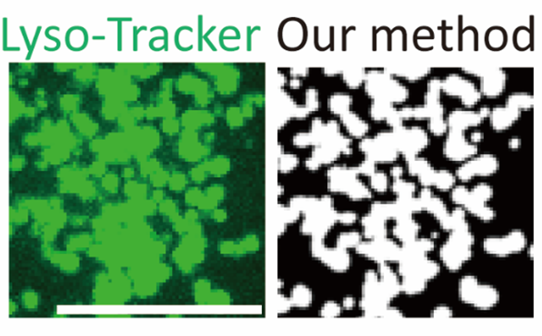
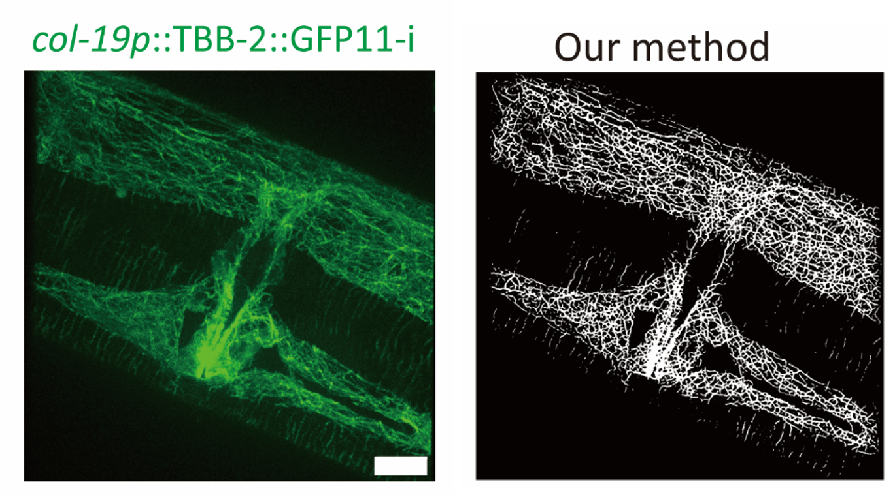
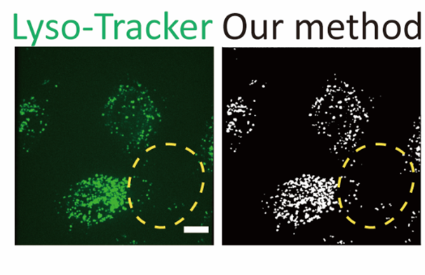

# SynSeg: Subcellular Structure Segmentation with Synthetic Data


[!\[Python Version](https://img.shields.io/badge/Python-3.8+-blue.svg)](https://www.python.org/downloads/)

[!\[PyTorch Version](https://img.shields.io/badge/PyTorch-2.0+-ee4c2c.svg)](https://pytorch.org/)

[!\[License: MIT](https://img.shields.io/badge/License-MIT-yellow.svg)](https://opensource.org/licenses/MIT)


**SynSeg** is a novel pipeline that leverages biologically-inspired synthetic datasets to train deep learning models for segmenting subcellular structures, including **microtubules** and **vesicles**. Our method eliminates the reliance on laborious manual annotation, simplifying dataset creation while maintaining high biological relevance.


With as few as **1,000 synthetic images** and **five training epochs**, SynSeg can produce models that achieve impressive performance on real-world microscopy data, without any fine-tuning. The framework is flexible and includes a complete suite of command-line tools for data generation, model training, and inference.





---

## 🌟 Key Features


* **No Manual Annotation**: Trains high-performance models exclusively on procedurally generated synthetic data.

* **High Performance from Minimal Data**: Achieves excellent results on experimental data after just a few epochs on ~1,000 synthetic images.

* **Flexible Data Generation**: Includes command-line tools to generate a wide variety of synthetic datasets with fine-grained control over noise, density, and other parameters.

* **Reproducible & Reusable**: All scripts are command-line driven, making experiments easy to script, reproduce, and share.


---

## 🔧 Installation


1.  **Clone the repository:**

```bash

git clone \[https://github.com/your-username/SynSeg.git](https://github.com/your-username/SynSeg.git)

cd SynSeg

```


2.  **Install dependencies:**

This project requires several common scientific computing and deep learning libraries. You can install them via pip.

```bash

pip install torch numpy opencv-python tqdm livelossplot matplotlib tifffile imagecodecs

```

*(Note: For GPU support, please install a version of PyTorch compatible with your CUDA toolkit by following the instructions on the \[official PyTorch website](https://pytorch.org/)).\*


---

## 🚀 Quick Start: Inference on an Example Image


Get started in seconds by running a pre-trained model on one of the provided example images. This command segments a test image and saves the resulting mask.


```bash

python model/SynSeg_cytoskeleton.py \

       -m weights/SynSeg_cytoskeleton_seg.pth \

       -i example/cytoskeleton/test_image.tif \

       -o example/cytoskeleton/output_mask.tif

```


---

## 📖 Full Workflow Guide


The SynSeg pipeline consists of three main steps: **Generate Data → Train Model → Run Inference**.


### Step 1: Generate Synthetic Datasets


Use the scripts in the `generator` directory to create custom training data.


#### Cytoskeleton Data (for U-Net)

```bash

python generator/cytoskeleton_generator.py 

   --output\_dir ./datasets/cytoskeleton_data 

   --num\_images 1000

```


#### Vesicle Data (for U-Net Segmentation)

```bash

python generator/vesicle_generator.py

   --output_dir ./datasets/vesicle_seg_data

   --num_images 1000

```

> **Tip:** Each script has many tunable parameters. Run it with the `-h` or `--help` flag to see all options. For example: `python generator/cytoskeleton_generator.py --help`.


### Step 2: Train a New Model


Use the scripts in the `train_code/` directory to train a U-Net model on the segmentation data you generated. *(Note: Your data directories must contain `train/` and `val/` subdirectories, each with `img/` and `mask/` folders inside).*


#### Train a Cytoskeleton Model

```bash

python train_code/Cytoskeleton_train.py

   --train_dir ./datasets/cytoskeleton_data/train

   --val_dir ./datasets/cytoskeleton_data/val

   --output_dir ./weights/cytoskeleton_custom

   --epochs 50

```

> **Tip:** For all training options, run the script with the `-h` flag.


### Step 3: Run Inference


Use the scripts in the `model/` directory with your trained weights to segment new images.


#### Recommended Practice: Physical Size Normalization

For the most robust and comparable results, we strongly recommend resizing your input images to a consistent physical scale before running inference. Our models were trained on data that simulates a pixel size of \*\*0.075 µm/pixel\*\*.


You can manually pre-process your images to match this. For example, if your original image has a pixel size of 0.150 µm/pixel, you should upscale it by a factor of 2 (`0.150 / 0.075 = 2`). If your original is 0.050 µm/pixel, you should downscale it by a factor of 0.667 (`0.050 / 0.075 ≈ 0.667`).


#### Cytoskeleton Segmentation

This command uses the default smart auto-resize logic.

```bash

python model/SynSeg_cytoskeleton.py

   -m weights/SynSeg_cytoskeleton\_seg.pth

   -i path/to/your/image.tif

   -o path/to/your/mask.png
   
   --resize 1024

```


#### Vesicle Segmentation

This command automatically saves both a probability map and a binarized mask using Otsu's method.

```bash

python model/SynSeg_vesicle.py

   -m weights/SynSeg_Vesicle\_seg.pth

   -i path/to/your/vesicle_image.tif

   -o results/vesicle_mask.png

```

> **Tip:** The inference scripts have multiple modes. The default is a smart auto-resize. You can override this with a fixed resize (`--resize\_size`) or force high-precision tiling (`--use\_tiling`). Run the script with the `-h` flag to see all options.


---

## 📦 Pre-trained Models


We provide several pre-trained model weights in the `weights/` directory:


* `SynSeg_cytoskeleton_seg.pth`: Standard model for cytoskeleton segmentation.

* `SynSeg_cytoskeleton_seg_2.pth`: Alternative cytoskeleton model.

* `SynSeg_Vesicle_seg.pth`: Standard model for vesicle segmentation.

* `SynSeg_Vesicle_seg_2.pth`: Alternative vesicle model.


---

## 🖼️ Example Results


Below are examples of the model's performance on real microscopy images after being trained only on synthetic data.








